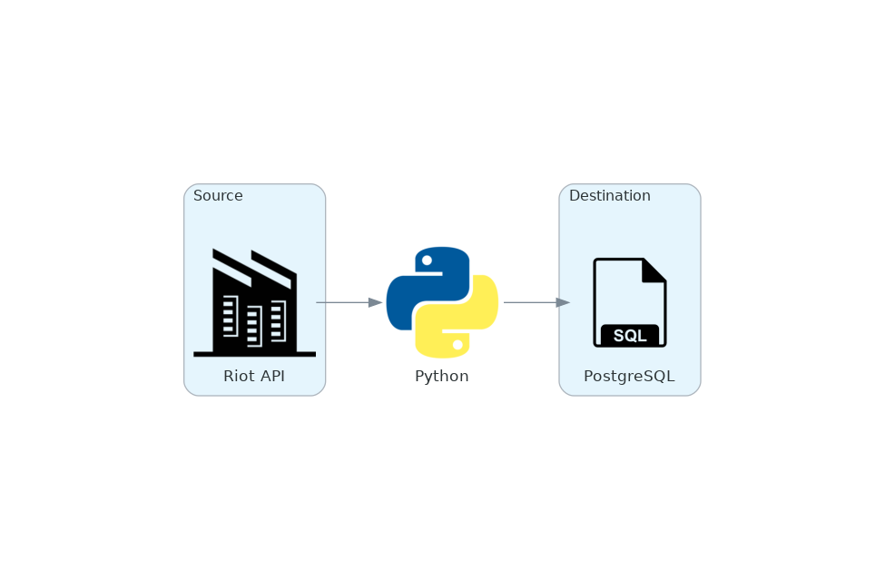

# TFT
This is an ETL pipeline that: 
1. pulls data from the [Riot API](https://developer.riotgames.com/) using python and the [riotwatcher](https://github.com/pseudonym117/Riot-Watcher) library.
2. transforms the data in memory using pandas and built in python functionality
3. inserts the the data into a postgres dataabse using [psycopg2](https://github.com/psycopg/psycopg2)

## Architecture
